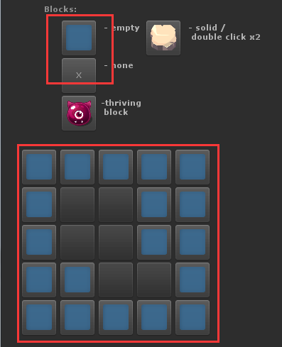
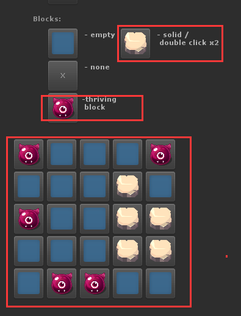
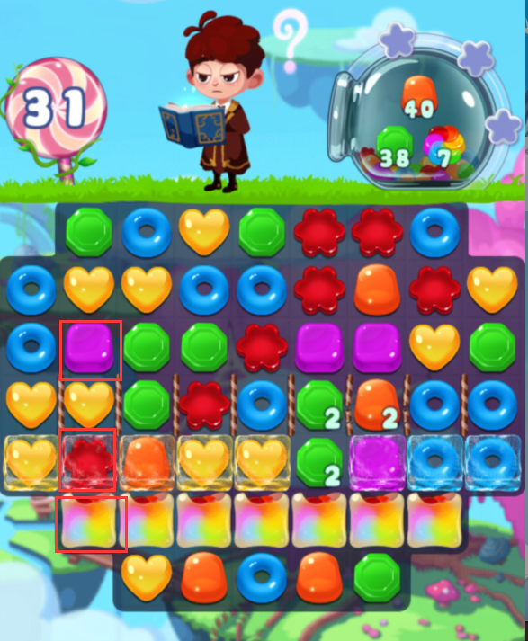

# 基础需求

## 
    1.下按格子有选中效果(基本属于放大,变亮)
        并且选择当前作为第一目标
    2.移动到另外一个新的格式的时候，如果两个相邻 ij+1 那么可以变动
        当选择新的东西之后， 就这两个进行消除，否则回退回去

# 地图编辑器工具   
    
    
    通关条件
    结束条件 步伐或者时间
    收集目标 
    基础的item的几率等等
    等待策划提供一套详细的方案
## 基础功能提供地图编辑编辑地表，是否可以有内容在   
    

## 提供item编辑器，编辑每个地方可以存放的内容

